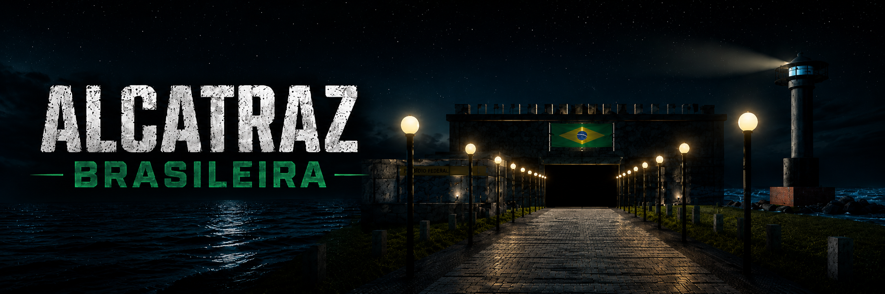

<div align="center">

# 🏝️ Alcatraz Brasileira



<br>

<p>
  
  
  
  
  
</p>


</div>

---

## 📌 Sobre o projeto

**Alcatraz Brasileira** é um passeio virtual 3D em primeira pessoa desenvolvido como projeto prático da disciplina de **Computação Gráfica**.

O objetivo do projeto é conduzir o usuário por uma ilha-prisão fictícia, passando pelo píer, posto de fiscalização, estrada principal, portões automáticos, refeitório, áreas internas, sala das celas e finalização do passeio. A partir dessa proposta, o projeto aplica, de forma visual e interativa, conceitos como **WebGL**, **shaders GLSL**, **projeção perspectiva**, **câmera FPS**, **iluminação Phong**, **fontes de luz móveis**, **transformações geométricas**, **animações 3D**, **texturização**, **céu HDRI**, **oceano procedural** e **leitor próprio de OBJ**.

---

## ▶️ Vídeo do projeto

Confira abaixo uma apresentação em vídeo que destaca os principais aspectos do projeto, incluindo a exploração do ambiente em 3D, a navegação em primeira pessoa, os efeitos visuais e as interações disponíveis durante a experiência.

<div align="center">
  <table width="100%">
    <tr>
      <th width="15%" align="center">Ícone</th>
      <th width="20%" align="center">Plataforma</th>
      <th width="65%" align="center">Link do vídeo</th>
    </tr>
    <tr>
      <td align="center">
        
      </td>
      <td align="center"><strong>YouTube</strong></td>
      <td align="center"><a href="#">Adicionar link da demonstração</a></td>
    </tr>
  </table>
</div>

---

## 🖼️ Preview do jogo

<table width="100%" cellspacing="0" cellpadding="0">
  <tr>
    <td width="50%" valign="top">
      <h2>🕹️ Como jogar</h2>
      <h3>🎯 Objetivo</h3>
      <table width="100%" cellspacing="0" cellpadding="6">
        <tr align="center">
          <th width="18%">Meta</th>
          <th width="70%">Descrição</th>
          <th width="12%">Visual</th>
        </tr>
        <tr align="center">
          <td><strong>Chegar à ilha</strong></td>
          <td>Inicie o passeio no píer e caminhe até o posto de fiscalização.</td>
          <td>
            
          </td>
        </tr>
        <tr align="center">
          <td><strong>Explorar setores</strong></td>
          <td>Passe pelos portões automáticos, refeitório, áreas internas e celas.</td>
          <td>
            
          </td>
        </tr>
        <tr align="center">
          <td><strong>Finalizar passeio</strong></td>
          <td>Conclua a experiência atravessando a porta de saída no setor final.</td>
          <td>
            
          </td>
        </tr>
      </table>
      <br>
      <h3>⌨️🖱️ Controles</h3>
      <table width="100%" cellspacing="0" cellpadding="6">
        <tr align="center">
          <th width="18%">Entrada</th>
          <th width="70%">Descrição</th>
          <th width="12%">Visual</th>
        </tr>
        <tr align="center">
          <td><strong>W A S D</strong></td>
          <td>Move o jogador pelo ambiente 3D.</td>
          <td>
            
          </td>
        </tr>
        <tr align="center">
          <td><strong>MOUSE</strong></td>
          <td>Controla a direção da câmera em primeira pessoa.</td>
          <td>
            
          </td>
        </tr>
        <tr align="center">
          <td><strong>SHIFT</strong></td>
          <td>Aumenta a velocidade de deslocamento.</td>
          <td>
            
          </td>
        </tr>
        <tr align="center">
          <td><strong>ESC</strong></td>
          <td>Abre ou fecha o menu de pausa.</td>
          <td>
            
          </td>
        </tr>
      </table>
    </td>
    <td width="50%" valign="middle" align="center">
      
    </td>
  </tr>
</table>

---

## 🧱 Pipeline gráfico do projeto

<div align="center">
  <table width="100%">
    <tr align="center">
      <th>1. Entrada</th>
      <th>2. Câmera</th>
      <th>3. Cena</th>
      <th>4. Shaders</th>
      <th>5. Render</th>
    </tr>
    <tr align="center">
      <td></td>
      <td></td>
      <td></td>
      <td></td>
      <td></td>
    </tr>
    <tr align="center">
      <td>Teclado e mouse</td>
      <td>View + Projection</td>
      <td>Objetos, materiais e animações</td>
      <td>GLSL + uniforms</td>
      <td>Draw calls WebGL</td>
    </tr>
  </table>
</div>

---

## 🧩 Mecânicas e elementos principais

<table width="100%">
  <tr align="center">
    <th width="25%">Elemento</th>
    <th width="55%">Descrição técnica</th>
    <th width="20%">Demonstração conceitual</th>
  </tr>
  <tr>
    <td align="center"><strong>Introdução cinematográfica</strong></td>
    <td>A câmera inicia no mar, acompanha a chegada pelo Lifeboat e libera os controles após o desembarque.</td>
    <td align="center"></td>
  </tr>
  <tr>
    <td align="center"><strong>Sally Port</strong></td>
    <td>Portão externo com abertura automática por proximidade, criando a sensação de entrada controlada na prisão.</td>
    <td align="center"></td>
  </tr>
  <tr>
    <td align="center"><strong>Posto de fiscalização</strong></td>
    <td>Estrutura 3D com janela fumê, porta lateral automática com pivô realista, mesa, cadeira e monitores.</td>
    <td align="center"></td>
  </tr>
  <tr>
    <td align="center"><strong>Faróis</strong></td>
    <td>Torres com feixe visual e rotação contínua, reforçando a ambientação noturna e a leitura espacial da ilha.</td>
    <td align="center"></td>
  </tr>
  <tr>
    <td align="center"><strong>Ambientes internos</strong></td>
    <td>Refeitório, controle, enfermagem e celas organizados em sequência para estruturar o percurso do jogador.</td>
    <td align="center"></td>
  </tr>
  <tr>
    <td align="center"><strong>Sala das celas</strong></td>
    <td>Ambiente mais escuro com lanterna automática e luz vermelha fraca para alterar a atmosfera final do passeio.</td>
    <td align="center"></td>
  </tr>
</table>

---

## 🧠 Conceitos de Computação Gráfica aplicados

<table width="100%">
  <tr align="center">
    <th width="25%">Conceito</th>
    <th width="50%">Como foi implementado</th>
    <th width="25%">Resultado visual</th>
  </tr>
  <tr>
    <td align="center"><strong>Projeção perspectiva</strong></td>
    <td>Matriz perspective própria com FOV, aspect ratio, near e far para gerar profundidade na cena.</td>
    <td align="center"></td>
  </tr>
  <tr>
    <td align="center"><strong>Câmera FPS</strong></td>
    <td>Posição e orientação controladas por teclado e mouse, usando yaw, pitch, forward e right.</td>
    <td align="center"></td>
  </tr>
  <tr>
    <td align="center"><strong>Iluminação Phong</strong></td>
    <td>Shader GLSL com componentes ambiente, difusa e especular, além de normais e posição da luz.</td>
    <td align="center"></td>
  </tr>
  <tr>
    <td align="center"><strong>Transformações 3D</strong></td>
    <td>Objetos posicionados com matrizes de translação, rotação e escala, compondo o pipeline Model-View-Projection.</td>
    <td align="center"></td>
  </tr>
  <tr>
    <td align="center"><strong>Animações</strong></td>
    <td>Atualização temporal com deltaTime para farol, portões, barco, oceano, luzes e elementos da cena.</td>
    <td align="center"></td>
  </tr>
  <tr>
    <td align="center"><strong>Texturização</strong></td>
    <td>Mapeamento UV, texturas procedurais e imagens para concreto, metal, madeira, placas, céu e faces.</td>
    <td align="center"></td>
  </tr>
  <tr>
    <td align="center"><strong>Leitor OBJ</strong></td>
    <td>Parser próprio para importar o modelo Lifeboat, interpretando vértices, faces e grupos do arquivo OBJ.</td>
    <td align="center"></td>
  </tr>
  <tr>
    <td align="center"><strong>Céu HDR</strong></td>
    <td>HDR panorâmico convertido para textura tone-mapped e aplicado como skydome 360° em torno da câmera.</td>
    <td align="center"></td>
  </tr>
</table>

---

## 🌌 Céu com HDR panorâmico

O céu do projeto foi construído a partir de um arquivo **HDR panorâmico** baixado e convertido para uma textura compatível com WebGL. A textura final é aplicada em um **skydome** centralizado na câmera, criando um ambiente noturno 360° sem depender de uma skybox tradicional.

<table width="100%">
  <tr align="center">
    <th width="25%">Etapa</th>
    <th width="55%">Função</th>
    <th width="20%">Arquivo / técnica</th>
  </tr>
  <tr>
    <td align="center"><strong>HDR original</strong></td>
    <td>Fonte panorâmica de iluminação visual do céu noturno.</td>
    <td align="center"><code>.hdr</code></td>
  </tr>
  <tr>
    <td align="center"><strong>Tone mapping</strong></td>
    <td>Conversão do HDR para imagem visual compatível com textura 2D no navegador.</td>
    <td align="center"><code>.png</code> / <code>.jpg</code></td>
  </tr>
  <tr>
    <td align="center"><strong>Skydome</strong></td>
    <td>Esfera grande envolvendo a cena e acompanhando a posição da câmera.</td>
    <td align="center">Esfera 3D</td>
  </tr>
  <tr>
    <td align="center"><strong>Shader do céu</strong></td>
    <td>Amostragem da textura equiretangular a partir da direção de visão.</td>
    <td align="center">GLSL</td>
  </tr>
</table>

---

## 🧠 Organização técnica dos arquivos

<table width="100%">
  <tr align="center">
    <th width="24%">Arquivo</th>
    <th width="56%">Responsabilidade</th>
    <th width="20%">Área</th>
  </tr>
  <tr>
    <td align="center"><code>math.js</code></td>
    <td>Operações vetoriais e matriciais: identidade, translação, rotação, escala, lookAt, perspective e matriz normal.</td>
    <td align="center">Matemática 3D</td>
  </tr>
  <tr>
    <td align="center"><code>geometry.js</code></td>
    <td>Geração de malhas básicas e parser OBJ para modelos externos.</td>
    <td align="center">Geometria</td>
  </tr>
  <tr>
    <td align="center"><code>textures.js</code></td>
    <td>Criação de texturas procedurais, texturas de imagem, faces ovais, placas e céu HDR.</td>
    <td align="center">Texturas</td>
  </tr>
  <tr>
    <td align="center"><code>mesh.js</code></td>
    <td>Criação dos buffers WebGL e desenho das malhas.</td>
    <td align="center">Renderização</td>
  </tr>
  <tr>
    <td align="center"><code>camera.js</code></td>
    <td>Controle da câmera em primeira pessoa e atualização da direção de visão.</td>
    <td align="center">Câmera</td>
  </tr>
  <tr>
    <td align="center"><code>input.js</code></td>
    <td>Eventos de teclado, mouse e pointer lock para navegação.</td>
    <td align="center">Entrada</td>
  </tr>
  <tr>
    <td align="center"><code>shaders.js</code></td>
    <td>Shaders GLSL para objetos, água e céu.</td>
    <td align="center">GLSL</td>
  </tr>
  <tr>
    <td align="center"><code>scene.js</code></td>
    <td>Construção da ilha, objetos, portas, faróis, ambientes internos, animações e colisões.</td>
    <td align="center">Cena</td>
  </tr>
  <tr>
    <td align="center"><code>main.js</code></td>
    <td>Inicialização do WebGL, loop principal, HUD, estados de jogo, pause e introdução cinematográfica.</td>
    <td align="center">Aplicação</td>
  </tr>
</table>

---

## 📁 Estrutura do projeto

```text
alcatraz-brasileira-webgl/
│
├── index.html                  # Estrutura HTML, telas e canvas WebGL
├── style.css                   # Interface, HUD, menu inicial, pausa e tela final
├── README.md                   # Documentação do projeto
│
├── assets/
│   ├── models/
│   │   └── Lifeboat.obj        # Modelo OBJ usado na chegada de barco
│   ├── readme/                 # Imagens e GIFs usados nesta documentação
│   ├── ui/                     # Telas inicial e final
│   ├── *_portrait.jpg          # Retratos/texturas usadas nas celas
│   └── qwantani_*.hdr/png/jpg  # HDRI e versões tonemapped do céu
│
└── src/
    ├── math.js                 # Vetores, matrizes e álgebra linear
    ├── camera.js               # Câmera em primeira pessoa
    ├── input.js                # Teclado, mouse e pointer lock
    ├── shaders.js              # Shaders GLSL padrão, água e céu
    ├── textures.js             # Texturas procedurais e carregamento de imagens
    ├── geometry.js             # Geometrias manuais e leitor OBJ
    ├── mesh.js                 # Meshes, materiais e objetos de cena
    ├── scene.js                # Construção manual do cenário 3D
    ├── objModels.js            # OBJ embutido para carregamento no navegador
    └── main.js                 # Loop principal, estados, HUD e renderização
```

---

## 🚀 Como executar

### 1. Clone o repositório

```bash
git clone https://github.com/SEU_USUARIO/alcatraz-brasileira-webgl.git
cd alcatraz-brasileira-webgl
```

### 2. Inicie um servidor local

Como o navegador pode bloquear carregamento de assets locais por segurança, recomenda-se executar com servidor local:

```bash
python -m http.server 8000
```

### 3. Abra no navegador

```text
http://localhost:8000
```

> Também é possível abrir o arquivo `index.html` diretamente, mas o servidor local é a opção mais segura para carregar texturas, arquivos de imagem e assets corretamente.

---

## 👨‍💻 Autoria


<div align="left">
  
  &nbsp;&nbsp;
  
</div>

<hr>

<div align="left">
  
  &nbsp;&nbsp;
  
</div>

<hr>

<div align="left">
  
  &nbsp;&nbsp;
  
</div>
